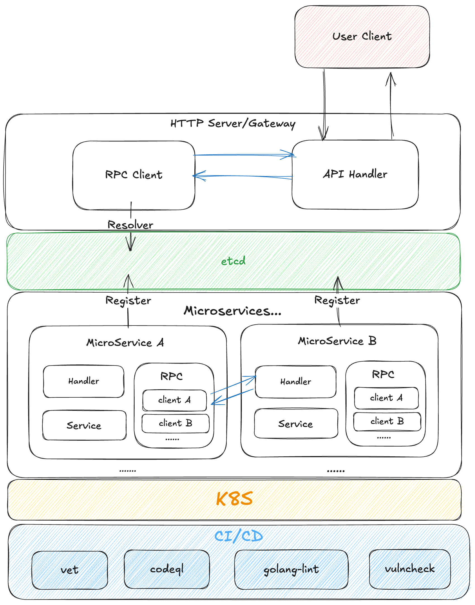
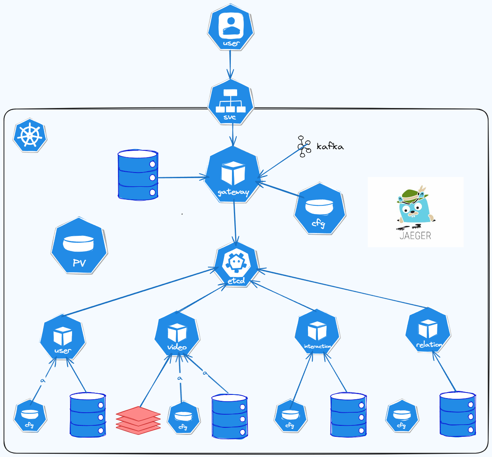
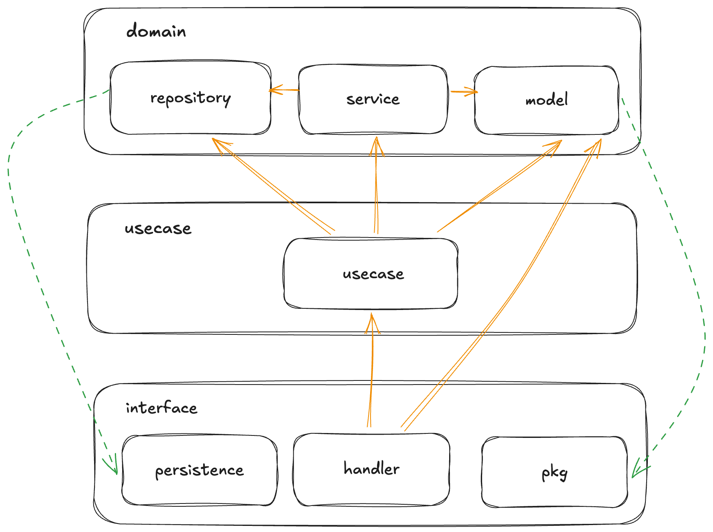

<div align="center">
  <h1 style="display: inline-block; vertical-align: middle;">tiktok</h1>
</div>

<div align="center">
  <a href="#overview">English</a> | <a href="docs/README.zh.md">中文</a>
</div>

## <a id="overview"></a>Overview

tiktok is a simple Tiktok backend based on a distributed architecture using HTTP and GRPC protocols with a clean architecture. It uses Kitex, Hertz, K8s, Docker, Gorm, Etcd, Kafka, Jaeger, Mysql, Redis
## Peculiarity
- Extremely simple deployment/update/down
- relatively good continuous integration
- relatively high code quality
- security considerations
- performance optimization for interfaces

## Architecture
### Project architecture


### Architecture in k8s


### Server architecture / Clean-architecture
Note: The brown lines refer to dependencies, and the green lines refer to implementation relationships


## Deploy
PR [#17](https://github.com/mutezebra/tiktok/pull/17) The deployment of tiktok has been refactored using shells and makefiles to make deployment easier, and building any service or integrating middleware now requires only one command
> make deploy

If the content of the project changes, you just need to change the relevant files, and then if the content of the project changes, you just need to change the relevant files, and
> make apply

If you want to clean up all built and deployed artifacts
> make down

## Project structure

### overview
```text
.
├── .github         # github workflow
├── Dockerfile
├── Makefile        # some useful commands
├── README.md
├── app             # microservices
├── deploy          # deploy files
├── docs
├── go.mod
├── go.sum
├── pkg
│   ├── consts      # store any consts
│   ├── discovery   # for discovery
│   ├── errno       # custom error
│   ├── idl         # definition interfaces
│   ├── kitex_gen   # generated code
│   └── utils       # useful utils
└── scripts
```

### gateway
```text
gateway
├── cmd             # build entry
├── config
├── domain
├── interface
│   ├── handler     # handler request
│   ├── middleware
│   ├── router
│   └── rpc         # send rpc request
└── usecase
```

### server
```text
user
├── cmd             # build entry
├── config
├── domain
│   ├── model       # define model interface
│   ├── repository  # define database interface
│   └── service     # core logic
├── interface
│   └── persistence # implement interface that defined in repository
└── usecase         # business logic
```

### Correlation extension
[Clean architecture in tiktok](https://mutezebra.github.io/blog/posts/clean-architecture-in-tiktok/)
