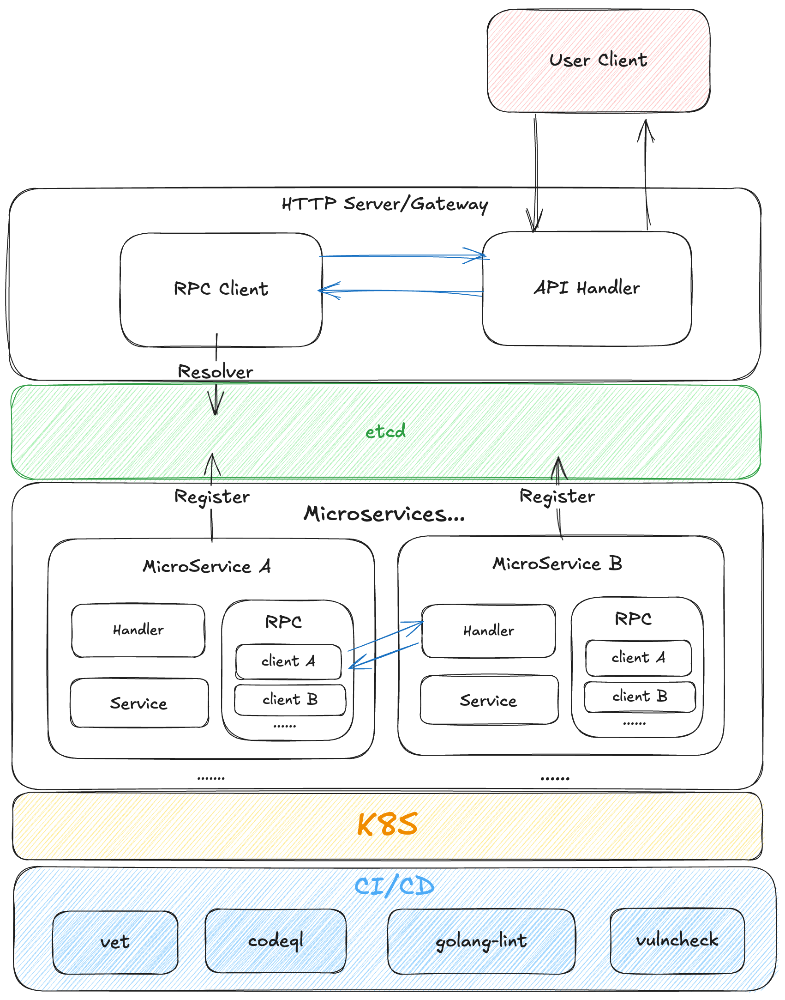
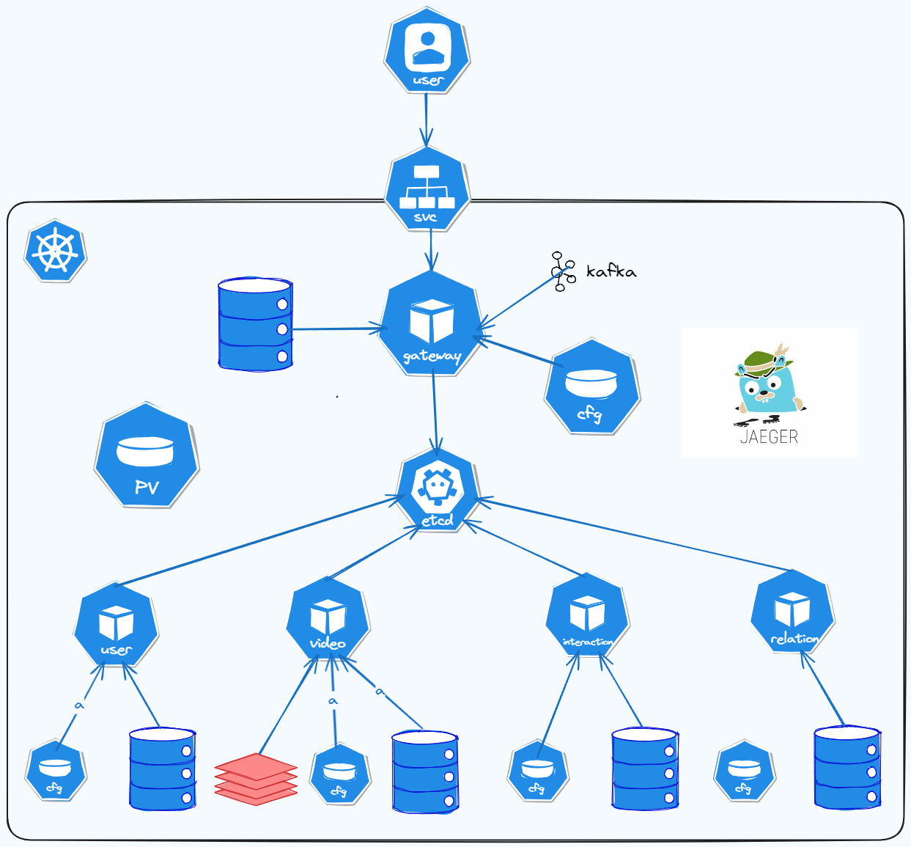
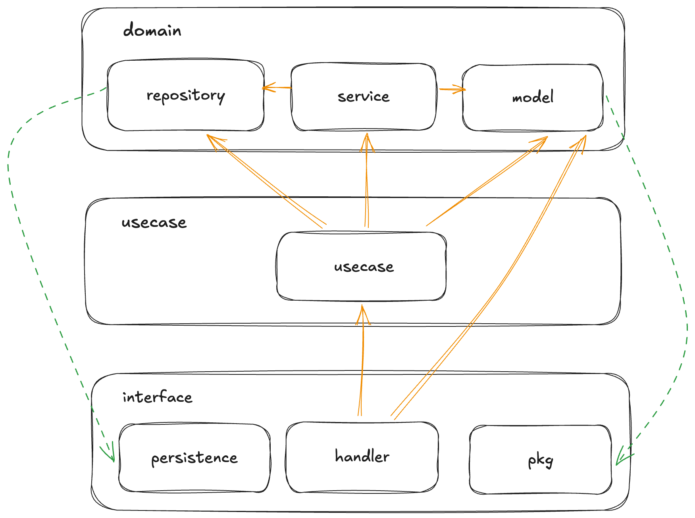

<div align="center">
  <h1 style="display: inline-block; vertical-align: middle;">tiktok</h1>
</div>

## <a id="overview"></a>概述

tiktok 是一个利用HTTP和GRPC协议, 基于分布式架构的与整洁架构简单抖音后端. 它使用到了 Kitex、Hertz、K8s、Docker、Gorm、Etcd、Kafka、Jaeger、Mysql、Redis

## 特性
- 极度简单部署/更新/部署
- 相对完善的持续集成
- 相对高的代码质量
- 安全性考量
- 对于接口的性能优化

## 架构
### 项目架构


### K8s中的结构


### 服务架构/整洁架构
注: 棕色线条指向的是依赖关系, 绿色线条指向的是实现关系


## 项目部署
PR [#17](https://github.com/mutezebra/tiktok/pull/17) 使用 shell 和 Makefile 重构了 tiktok 的部署方式, 使得部署更加简单, 任意服务的构建或中间件的集成现在都只需要一条命令
> make deploy

如果项目的内容有所变动, 你只需要更改相关文件, 然后
> make apply

如果你想要清除所有构建和部署的产物
> make down

## 项目结构

### 总览
```text
.
├── .github         # github workflow
├── Dockerfile
├── Makefile        # some useful commands
├── README.md
├── app             # microservices
├── deploy          # deploy files
├── docs
├── go.mod
├── go.sum
├── pkg
│   ├── consts      # store any consts
│   ├── discovery   # for discovery
│   ├── errno       # custom error
│   ├── idl         # definition interfaces
│   ├── kitex_gen   # generated code
│   └── utils       # useful utils
└── scripts
```

### 网关
```text
gateway
├── cmd             # build entry
├── config
├── domain
├── interface
│   ├── handler     # handler request
│   ├── middleware
│   ├── router
│   └── rpc         # send rpc request
└── usecase
```

### 服务
```text
user
├── cmd             # build entry
├── config
├── domain
│   ├── model       # define model interface
│   ├── repository  # define database interface
│   └── service     # core logic
├── interface
│   └── persistence # implement interface that defined in repository
└── usecase         # business logic
```

### 相关扩展
[tiktok 中的整洁架构](https://mutezebra.github.io/blog/posts/clean-architecture-in-tiktok/)
